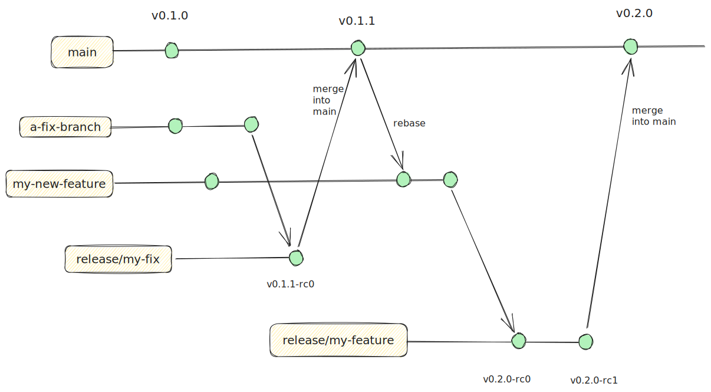

# Release

## Getting started

To add this 

```shell
mkdir -p .github/workflows
cat <<EOF | tee .github/workflows/release.yaml
name: Release

on:
  push:
    branches:
      - main
      - release/**

jobs:
  release:
    permissions:
      contents: write
      issues: write
      pull-requests: write
    runs-on: ubuntu-22.04
    steps:
      - name: Setup Git
        uses: alexandremahdhaoui/setup-git@v0.0.3
        with:
          SSH_PRIVATE_KEY: ${{ secrets.SSH_PRIVATE_KEY }}
      - uses: alexandremahdhaoui/release@v0.2.2
        with:
          GH_TOKEN: ${{ secrets.GH_TOKEN }}
EOF
```

## Git Workflow

We want to adopt a git workflow that seamlessly integrate with our deployment. To 

What do we want:
- The default branch should reflect `prod` & `preprod` environments
- `release/**` branches would reflect `staging` environments.
- Any other branches could reflect what's deployed in our dev environments. Development branches should be subject to
  tests, but aren't required to reflect any environment. 
  - We rely on tests to ensure quality of what will be "pre-released" in staging.



## Release from pre-prod to prod

How does it work?

Preprod should be a copy of production on which we can run e2e tests. However, how should we differentiate what's 
deployed in preprod & prod? How is that process automated?
- `preprod` is synced with the latest released tags and runs automated e2e tests. 
  - When tests passes, we create a new tag
    with `-stable`.
  - Canary deployments allow multiple `-stable` releases to be concurrently deployed & tested in our pre-production 
    environment.
- `prod` is synced with `-stable` tags.
  - Canary deployments allow multiple concurrent `-stable` releases deployed in our production environment.

### OR:

Another approach would be deploying pre-releases from `release/**` branches to pre-production and merging PRs that 
passes tests. This then allows to deploy development branches to staging concurrently.

